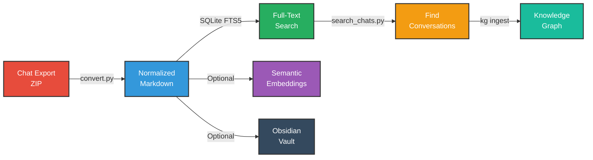

# LLM Chat Knowledge Converter 🧠


**Transform your AI conversations into a searchable knowledge base with knowledge graph integration.**

Convert LLM chat exports (Claude, ChatGPT) into a unified, searchable format with full-text search, semantic embeddings, and knowledge graph ingestion capabilities. Your conversations become a queryable knowledge repository that integrates with sophisticated knowledge management systems.

## 🎯 What This Does

This toolkit provides a complete pipeline for converting, searching, and ingesting LLM conversations:



## 🚀 Quick Start

### Installation

```bash
git clone https://github.com/aaronsb/llmchat-knowledge-converter.git
cd llmchat-knowledge-converter
./scripts/install-pipx.sh  # One-time setup
```

### Basic Usage

```bash
# Convert (both providers auto-detected)
llmchat-convert claude export.zip --name my-vault
llmchat-convert chatgpt export.zip --name my-vault

# Search conversations
llmchat-search output/my-vault "search query"

# Get paths for knowledge graph ingestion
llmchat-search output/my-vault "topic" --json --ontology topic-name
```

## 📥 Exporting Chat History

<details>
<summary><b>📘 Claude Export</b></summary>

1. Visit https://claude.ai/settings
2. Click "Download my data"
3. Wait for email with download link
4. Download the ZIP file

**Note**: The export contains `conversations.json`, `projects.json`, and `users.json` in a single ZIP.
</details>

<details>
<summary><b>📗 ChatGPT Export</b></summary>

1. Sign in to ChatGPT
2. Click your profile icon (top right)
3. Settings → Data controls → Export data
4. Click "Confirm export"
5. Check email for download link (expires in 24 hours)
6. Download the ZIP file

**Note**: The export includes `conversations.json` and any images from DALL-E or uploads.
</details>

## 🔄 Conversion Workflow

### Convert to Searchable Format

```bash
# Basic conversion (FTS search only)
python src/convert.py claude ~/Downloads/export.zip --name my-vault --no-embeddings

# With semantic search (requires Nomic API key)
python src/convert.py chatgpt ~/Downloads/export.zip --name my-vault

# Skip tag configuration
python src/convert.py claude export.zip --name my-vault --skip-tags
```

**Output structure:**
```
output/my-vault/
├── conversations/              # Year/Month/Day/ConversationName/
│   └── 2025/
│       └── 11-November/
│           └── 20/
│               └── Barbecue_Philosophy_a1b2c3d4/
│                   ├── messages/
│                   │   ├── *.json          # Message metadata
│                   │   └── *.md            # Markdown content (for KG)
│                   ├── images/             # Preserved images
│                   └── metadata.json
├── conversations.db            # SQLite with FTS5
└── .obsidian/                 # Optional Obsidian config
```

## 🔍 Searching Conversations

### Full-Text Search (No Embeddings Needed)

```bash
# Basic search
llmchat-search output/my-vault "barbecue"

# Keyword search
llmchat-search output/my-vault "keyword:javascript"

# Limit results
llmchat-search output/my-vault "machine learning" --limit 10
```

### Knowledge Graph Integration

Get file paths for selective ingestion into knowledge graph systems:

```bash
# Conversation-level (directories)
llmchat-search output/my-vault "topic" --json --ontology topic-name

# File-level (markdown files)
llmchat-search output/my-vault "topic" --json --granularity file

# Message-level (all files)
llmchat-search output/my-vault "topic" --json --granularity message
```

**Example workflow:**
```bash
# 1. Search for conversations
llmchat-search output/my-vault "philosophy consciousness" --json > results.json

# 2. Ingest into knowledge graph (if using kg system)
kg ingest directory /path/to/conversation -o philosophy-discussions -r --depth 1
```

## 🌟 Features

### Unified Conversion
- ✅ **Single Tool** - One CLI for both Claude and ChatGPT
- ✅ **Direct ZIP Input** - No manual extraction needed
- ✅ **Auto-Detection** - Provider detected automatically
- ✅ **Normalized Output** - Identical structure for both providers

### Search Capabilities
- 🔍 **Full-Text Search** - SQLite FTS5 for instant keyword search
- 🧠 **Semantic Search** - Optional Nomic embeddings (local or remote)
- 🎯 **Keyword Extraction** - TF-IDF based tagging
- 📊 **Statistics** - Message counts, date ranges, keyword analytics

### Knowledge Graph Ready
- 📂 **Multiple Granularities** - Conversation, file, or message level
- 🔗 **Absolute Paths** - Ready for external tool ingestion
- 🏷️ **Ontology Suggestions** - Auto-generated from search queries
- 📋 **JSON Output** - Structured data for pipeline integration

### Content Preservation
- 📝 **Markdown Extraction** - Formatting preserved
- 💻 **Code Snippets** - Syntax highlighting ready
- 🖼️ **Images** - DALL-E and uploaded images preserved
- 🗂️ **Metadata** - Full conversation context retained

## 🔗 Integration with Knowledge Graph Systems

This converter is designed to work with knowledge graph systems that extract concepts and relationships from documents. The search tool outputs file paths in formats compatible with:

- **Custom knowledge graph systems** (via MCP integration)
- **Graph databases** (Neo4j, Apache AGE, etc.)
- **Vector databases** (with semantic search)
- **Note-taking tools** (Obsidian, Logseq, etc.)

### Example: Continuous Knowledge Accumulation

```bash
# Weekly workflow: ingest new conversations into persistent ontologies
# 1. Export new conversations from Claude/ChatGPT
# 2. Convert to searchable format
llmchat-convert claude weekly-export.zip --name weekly-vault

# 3. Search for specific topics
llmchat-search output/weekly-vault "system architecture" --json > arch.json

# 4. Ingest selected conversations into knowledge graph
kg ingest directory /path/from/search -o system-architecture -r --depth 1
```

## 🎨 Obsidian Integration (Optional)

The converter also works as an Obsidian vault generator:

1. Convert your export (vault created in `output/`)
2. Move to your Obsidian vaults location:
   ```bash
   mv output/my-vault ~/Documents/ObsidianVaults/
   ```
3. Open in Obsidian → Graph View

**Obsidian MCP Plugin**: Use [obsidian-mcp-plugin](https://github.com/aaronsb/obsidian-mcp-plugin) to let Claude interact with your vault.

## ⚙️ Advanced Options

### Embedding Generation

```bash
# Requires Nomic API key (for remote) or local model
export NOMIC_API_KEY=your_key_here
llmchat-convert claude export.zip --name vault-with-embeddings
```

### Tag Configuration

```bash
# Interactive tag/color setup (Obsidian graph)
llmchat-convert claude export.zip --name my-vault

# Skip interactive setup
llmchat-convert claude export.zip --name my-vault --skip-tags
```

### Custom Exclusions

Edit `src/tag_exclusions.txt` to filter common words from keyword extraction.

## 📊 What Gets Indexed

The SQLite database tracks:
- **Conversations**: UUID, name, dates, message count, source provider
- **Messages**: Sender, content, timestamps, code detection
- **Keywords**: TF-IDF extracted tags with scores
- **Embeddings**: Optional semantic vectors (Nomic)
- **Full-Text Search**: FTS5 virtual table for instant search

## 🛠️ Architecture

### Normalized Data Structure

Both Claude and ChatGPT exports convert to identical structure:
```
conversations/YYYY/MM-MonthName/DD/ConversationName_ID/
├── messages/
│   ├── 000_human_*.json         # Message metadata
│   ├── 001_assistant_*.json
│   ├── *-001_Assistant_Message.md   # Markdown (KG-ready)
│   └── *-003_Assistant_Message.md
├── images/                      # Preserved media
└── metadata.json                # Conversation metadata
```

### Database Schema

- `conversations` - Main conversation table
- `messages` - Individual messages
- `keywords` - Extracted tags
- `embeddings` - Semantic vectors
- `messages_fts` - FTS5 virtual table

### Search Architecture

See [docs/ADR-001-semantic-search-architecture.md](docs/ADR-001-semantic-search-architecture.md) for design decisions.

## 📋 Requirements

- Python 3.11+
- SQLite 3.9+ (FTS5 support)
- Optional: Nomic API key for embeddings

**Python Dependencies:**
```
ijson>=3.2.0        # Streaming JSON parsing
nltk>=3.8.0         # Keyword extraction
nomic>=3.0.0        # Optional: embeddings
numpy>=1.24.0       # Vector operations
```

## 🤝 Contributing

This tool is part of a larger knowledge management ecosystem. Contributions welcome for:
- Additional LLM provider support (Gemini, Copilot, etc.)
- Local embedding models (sentence-transformers)
- Enhanced search algorithms
- Better keyword extraction

## 📄 License

MIT - Free to use, modify, and distribute.

## 🙏 Acknowledgments

Built to integrate with knowledge graph systems that externalize LLM latent space into queryable structures. Special thanks to the open source community for SQLite FTS5, NLTK, and Nomic embeddings.

---

**Related Projects:**
- [Knowledge Graph System](https://github.com/aaronsb/knowledge-graph-system) - Large Concept Model for persistent AI memory
- [Obsidian MCP Plugin](https://github.com/aaronsb/obsidian-mcp-plugin) - Claude integration for Obsidian vaults

*Built for the AI-assisted knowledge worker who keeps their promises.* 🚀
